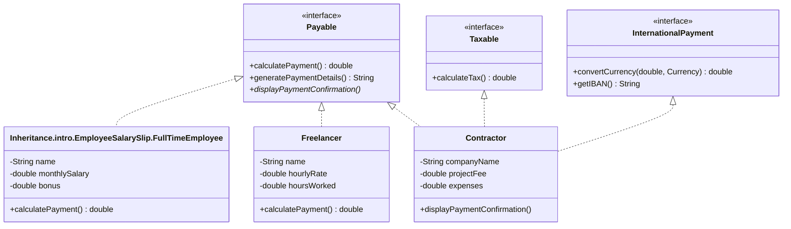
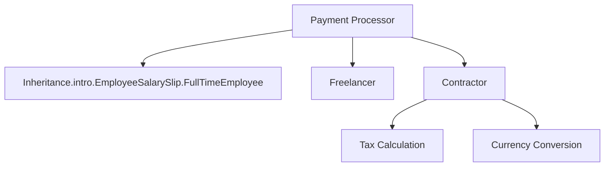

# Payable Package - Payment Processing System


Basics.oop.A robust Java payment processing system supporting multiple payee types, international payments, and tax calculations.

## 📊 Class Diagram



## 🏗️ Architecture



## 🌟 Features

- Multiple payment types (salary, hourly, project-based)
- International payment support
- Automatic tax calculations
- Payment history tracking
- Customizable payment methods

## 🚀 Quick Start

```java
// 1. Create payees
Payable[] payables = {
    new Inheritance.intro.EmployeeSalarySlip.FullTimeEmployee("Jane Smith", 5000, 1000),
    new Freelancer("John Doe", 50.0, 80),
    new Contractor("Tech Solutions", 15000, 2500)
};

// 2. Process payments
for (Payable payable : payables) {
    System.out.println(payable.generatePaymentDetails());
    System.out.printf("Amount: $%.2f%n", payable.calculatePayment());
    payable.displayPaymentConfirmation();
}
```

## 📝 Sample Output

```
Inheritance.intro.EmployeeSalarySlip.Inheritance.intro.Abstraction.Employee: Jane Smith
Salary: $5000.00 | Bonus: $1000.00
Total Payment: $6000.00
Payment processed successfully
----------------------
Freelancer: John Doe
Hours: 80.00 | Rate: $50.00/hr
Total Payment: $4000.00
Payment processed successfully
----------------------
```

## 🔧 Payment Methods


## 📚 Documentation

| Component | Description |
|-----------|-------------|
| `Payable` | Core payment interface |
| `Taxable` | Handles tax calculations |
| `InternationalPayment` | Manages cross-border payments |
| `Inheritance.intro.EmployeeSalarySlip.FullTimeEmployee` | Salaried employee implementation |
| `Freelancer` | Hourly worker implementation |
| `Contractor` | Project-based worker with international support |

## 🤝 Contributing

1. Fork the repository
2. Create your feature branch
3. Commit your changes
4. Push to the branch
5. Open a pull request

## 📜 License

MIT © 2023 Harshit Pande

---

💡 **Tip**: Use the `PaymentProcessor` class for batch processing payments with automatic tax and currency conversion handling.
```

This README includes:
- Badges for quick info
- Visual diagrams (class, flow, pie chart)
- Code examples with syntax highlighting
- Clean documentation table
- Contribution guidelines
- Professional formatting
