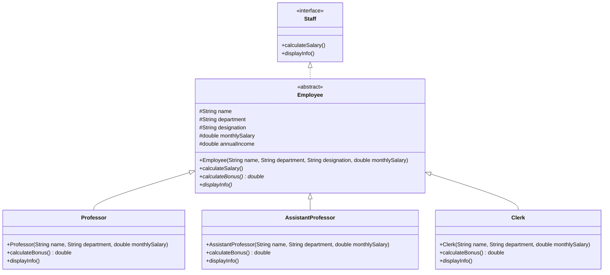

# University Staff Management System

This Java application manages different types of university staff members, their salaries, and bonuses. It demonstrates object-oriented principles including inheritance, polymorphism, and interfaces.

## Class Structure



## Key Features

1. **Staff Hierarchy**:
   - `Employee` abstract class implements `Staff` interface
   - Concrete classes: `Professor`, `AssistantProfessor`, and `Clerk`

2. **Core Functionality**:
   - Salary calculation (monthly to annual)
   - Role-specific bonus calculations
   - Detailed information display

3. **Design Patterns**:
   - Template Method Pattern (via `Employee` abstract class)
   - Strategy Pattern (different bonus calculations)

## Class Responsibilities

| Class | Responsibility |
|-------|----------------|
| `Staff` | Interface defining staff operations |
| `Employee` | Abstract base class with common attributes |
| `Professor` | Handles professor-specific calculations (10% bonus) |
| `AssistantProfessor` | Handles assistant professor calculations (8% bonus) |
| `Clerk` | Handles clerk calculations (5% bonus) |

## Usage Example

```java
ArrayList<Staff> staff = new ArrayList<>();
staff.add(new Professor("Dr. Smith", "Computer Science", 20000));
staff.add(new AssistantProfessor("Dr. Johnson", "Mathematics", 15000));
staff.add(new Clerk("Mr. Williams", "Administration", 10000));

for (Staff member : staff) {
    member.displayInfo();
}
```

## Output Format

```
Name: Dr. Smith
Department: Computer Science
Designation: Professor
Salary per Month: $20000.00 | Annual Income: $240000.00 | Bonus: $24000.00
----------------------------
```

## Design Principles

1. **SOLID Principles**:
   - Single Responsibility (each class has one purpose)
   - Open/Closed (open for extension, closed for modification)
   - Liskov Substitution (subtypes are substitutable)
   - Interface Segregation (focused interfaces)
   - Dependency Inversion (depends on abstractions)

2. **DRY Principle**:
   - Common functionality in `Employee` base class
   - No code duplication between staff types
```

This README provides:
1. Clear visualization of the class structure
2. Explanation of key design decisions
3. Usage examples
4. Output format documentation
5. Highlighted design principles

The Mermaid diagram shows the inheritance hierarchy and relationships between the classes and interface, making it easy to understand the system architecture at a glance.
